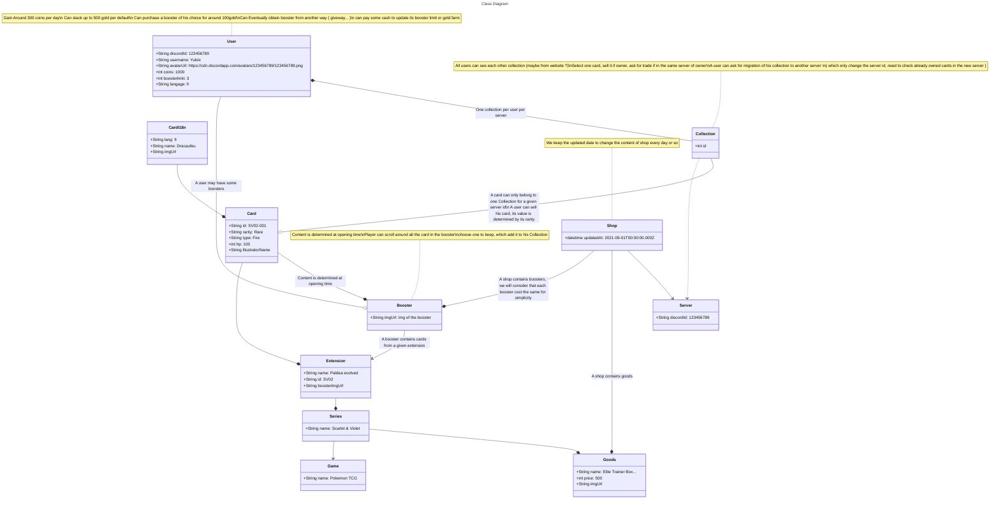

# Pokemon TCG
## A Pokemon TCG discord.js bot made by @Yukiix

```mermaid
---
title: Class Diagram
---
classDiagram
    class Game{
    +String name: Pokemon TCG
    }
    class Series{
    +String name: Scarlet & Violet
    }
    Series --> Game
    class Extension{
    +String name: Paldea evolved
    +String id: SV02
    +String boosterImgUrl
    }
    Extension --* Series
    Card --* Extension
    class Card{
    +String id: SV02-001
    +String rarity: Rare
    +String type: Fire
    +int hp: 100
    +String illustratorName
    }
    class CardI18n{
    +String lang: fr
    +String name: Dracaufeu
    +String imgUrl
    }
    CardI18n --* Card
    note for User "Gain Around 300 coins per day\n Can stack up to 500 gold per default\n Can purchase a booster of his choice for around 100gold\nCan Eventually obtain booster from another way ( giveway... )\n can pay some cash to update its booster limit or gold farm"
    class User{
        +String discordId: 123456789
        +String username: Yukiix
        +String avatarUrl: https://cdn.discordapp.com/avatars/123456789/123456789.png
        +int coins: 1000
        +int boosterlimit: 3
        +String langage: fr
    }
    note for Booster "Content is determined at opening time\nPlayer can scroll around all the card in the booster\nchoose one to keep, which add it to his Collection"
    class Booster{
        +String imgUrl: img of the booster
    }
    Card --* Booster: Content is determined at opening time
    User --o Booster: A user may have some boosters
    Booster --> Extension: A booster contains cards from a given extension
    note for Collection "All users can see each other collection (maybe from website ?)\nSelect one card, sell it if owner, ask for trade if in the same server of owner\nA user can ask for migration of his collection to another server \n( which only change the server id, need to check already owned cards in the new server )"
    class Collection{
        +int id
    }
    note for Shop "We keep the updated date to change the content of shop every day or so"
    class Shop{
        +datetime updatedAt: 2021-09-01T00:00:00.000Z
    }
    Shop --* Booster: A shop contains boosters, we will consider that each booster cost the same for simplicity
    Shop --* Goods: A shop contains goods
    Shop --> Server
    class Server{
        +String discordId: 123456789
    }
    User *-- Collection: One collection per user per server
    Collection ..> Server
    Collection --o Card: A card can only belong to one Collection for a given server id\n A user can sell his card, its value is determined by its rarity 
    class Goods{
        +String name: Elite Trainer Box...
        +int price: 500
        +String imgUrl
    }
    Series --* Goods
``` 